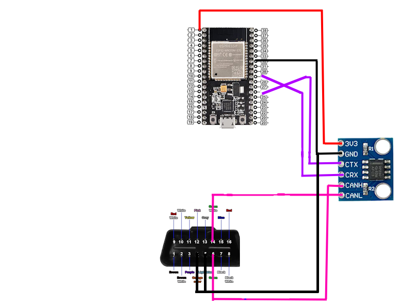

**OBDCar**
Physic and virtual interface between OBD (car) and PC 

## Overview
Features:
- Work in Wifi
- Work with software in command line
- Allow us to get capter value and editing errors

## Hardware
See the BOM in [bom.csv](bom.csv) or at the end of file

## Recap:
**Scheme:**


**Case:**
[Asset1](assets/assemblie.obj)
[Asset2](assets/CaseOBDCar.obj)

**Script**
```c
#include <WiFi.h>
#include "driver/twai.h"

const char* ssid = "OBD_CAR";
const char* password = "12345678";

WiFiServer server(35000);

void can_init() {
    twai_general_config_t g_config = TWAI_GENERAL_CONFIG_DEFAULT(GPIO_NUM_5, GPIO_NUM_4, TWAI_MODE_NORMAL);
    twai_timing_config_t t_config = TWAI_TIMING_CONFIG_500KBITS();
    twai_filter_config_t f_config = TWAI_FILTER_CONFIG_ACCEPT_ALL();

    twai_driver_install(&g_config, &t_config, &f_config);
    twai_start();
}

void send_obd(uint8_t mode, uint8_t pid) {
    twai_message_t msg;
    msg.identifier = 0x7DF;
    msg.extd = 0;
    msg.rtr = 0;
    msg.data_length_code = 8;

    msg.data[0] = 0x02;
    msg.data[1] = mode;
    msg.data[2] = pid;
    msg.data[3] = 0x00;
    msg.data[4] = 0x00;
    msg.data[5] = 0x00;
    msg.data[6] = 0x00;
    msg.data[7] = 0x00;

    twai_transmit(&msg, portMAX_DELAY);
}

String read_can() {
    twai_message_t msg;

    if (twai_receive(&msg, pdMS_TO_TICKS(1000)) == ESP_OK) {
        String out = "";

        for (int i = 0; i < msg.data_length_code; i++) {
            if (msg.data[i] < 0x10) out += "0";
            out += String(msg.data[i], HEX);
            out += " ";
        }
        return out;
    }
    return "NO DATA";
}

String decode_pid(String raw, String type) {

    if (type == "RPM") {
        int A = strtol(raw.substring(6,8).c_str(), NULL, 16);
        int B = strtol(raw.substring(9,11).c_str(), NULL, 16);
        int rpm = ((A * 256) + B) / 4;
        return String(rpm) + " RPM";
    }

    if (type == "SPEED") {
        int A = strtol(raw.substring(6,8).c_str(), NULL, 16);
        return String(A) + " km/h";
    }

    if (type == "TEMP") {
        int A = strtol(raw.substring(6,8).c_str(), NULL, 16);
        return String(A - 40) + " C";
    }

    return raw;
}

String handle_cmd(String cmd) {

    cmd.trim();

    if (cmd == "RPM") {
        send_obd(0x01, 0x0C);
        delay(100);
        return decode_pid(read_can(), "RPM");
    }

    if (cmd == "SPEED") {
        send_obd(0x01, 0x0D);
        delay(100);
        return decode_pid(read_can(), "SPEED");
    }

    if (cmd == "TEMP") {
        send_obd(0x01, 0x05);
        delay(100);
        return decode_pid(read_can(), "TEMP");
    }

    if (cmd == "DTC") {
        send_obd(0x03, 0x00);
        delay(200);
        return read_can();
    }

    if (cmd == "CLEAR") {
        send_obd(0x04, 0x00);
        delay(200);
        return "DTC CLEARED";
    }

    if (cmd == "VIN") {
        send_obd(0x09, 0x02);
        delay(200);
        return read_can();
    }

    return "CMD: RPM | SPEED | TEMP | DTC | CLEAR | VIN";
}

void setup() {
    Serial.begin(115200);

    WiFi.softAP(ssid, password);
    server.begin();

    can_init();

    Serial.println("OBD SERVER READY");
}

void loop() {

    WiFiClient client = server.available();

    if (client) {
        while (client.connected()) {

            if (client.available()) {

                String cmd = client.readStringUntil('\n');

                String response = handle_cmd(cmd);

                client.println(response);
                Serial.println(cmd + " -> " + response);
            }
        }
        client.stop();
    }
}
```

**Files**
[Code](code/code.ino)
[Scheme](scheme.png)

## BOM
| Catégorie     | Article                               | Quantité | Prix unitaire (€) | Prix total (€) | Notes               | URL                                                                                                          |
| ------------- | ------------------------------------- | -------: | ----------------: | -------------: | ------------------- | ------------------------------------------------------------------------------------------------------------ |
| Controls      | ESP-WROOM-32                          |        1 |              0.00 |           0.00 | Déjà en possession  |                                                                                                              |
| Connectique   | Wires                                 |        1 |              0.00 |           0.00 | Déjà en possession  |                                                                                                              |
| Communication | SN65HVD230 CAN Bus Transceiver Module |        1 |              0.64 |           0.64 |                     | [https://fr.aliexpress.com/item/1005012405624552.html](https://fr.aliexpress.com/item/1005012405624552.html) |
| Protection    | TVS Diode (1.5KE15CA)                 |        1 |              1.27 |           1.27 | Couleur : 1.5KE15CA | [https://fr.aliexpress.com/item/1005012022343939.html](https://fr.aliexpress.com/item/1005012022343939.html) |
| Connectique   | OBD2 Male Connector                   |        1 |              8.19 |           8.19 |                     | [https://fr.aliexpress.com/item/1005012437469335.html](https://fr.aliexpress.com/item/1005012437469335.html) |
| **TOTAL**     |                                       |          |                   |      **10.10** |                     |                                                                                                              |
